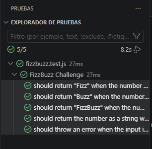

Kata FizzBuzz - Desarrollo Guiado por Pruebas (TDD)
# 📝Descripción
Este proyecto consiste en la resolución de una Kata matemática "FizzBuzz". El objetivo principal es construir una aplicación robusta en JavaScript que imprima una secuencia de números del 1 al 100, sustituyendo ciertos números por palabras clave basándose en reglas de divisibilidad específicas. La implementación se ha realizado utilizando la metodología de desarrollo guiado por pruebas (TDD) y un control de versiones estricto.

# 🔍Análisis
El núcleo del problema requiere evaluar un flujo de datos numéricos entrantes y transformarlos bajo los siguientes criterios lógicos:

- **Multiplicidad de 3**: Si un número es divisible por 3, la salida debe ser la cadena "Fizz".
- **Multiplicidad de 5**: Si un número es divisible por 5, la salida debe ser la cadena "Buzz".
- **Multiplicidad Común (3 y 5)**: Si un número es divisible por ambos valores (es decir, divisible por 15), la salida debe unificar las cadenas resultando en "FizzBuzz".
- **Casos de Regresión**: Si el número no cumple ninguna regla de divisibilidad, se debe retornar el propio número transformado a tipo de dato string (cadena).
- **Casos de Error**: El sistema debe ser tolerante a fallos y proteger el flujo de ejecución. Si el dato de entrada no corresponde estrictamente a un tipo numérico válido, el programa debe abortar la operación lanzando una excepción controlada.
# 🛠️Planificación
Estrategia de desarrollo dividida en hitos incrementales:

**Fase de Infraestructura**: Configuración del entorno de desarrollo aislado, definición del sistema de módulos y preparación de la suite de pruebas automatizadas.
**Ciclo Red-Green-Refactor (TDD)**: Abordar cada escenario de negocio de manera independiente, escribiendo la prueba antes que la lógica de producción.
**Orquestación del Sistema**: Una vez validados todos los algoritmos unitarios, se planificó la creación de un script indexado encargado de ejecutar el bucle iterativo del 1 al 100.
**Higiene del Repositorio**: Mantenimiento de un árbol de Git limpio, utilizando ramas de tareas de vida corta (Feature Branches) y eliminándolas localmente tras su fusión exitosa en la rama estable de desarrollo.
# Capturas del Proyecto
## Evidencia de Pruebas Automatizadas

# 💻Tecnologías Utilizadas
Las decisiones tecnológicas del proyecto se basan en estándares modernos de la industria:

**JavaScript**: Lenguaje de programación principal utilizando módulos nativos (import/export) para garantizar la modularidad del código.
**Node.js**: Entorno de ejecución en tiempo real para el backend, utilizado para ejecutar tanto el script principal como las herramientas de desarrollo.
**Vitest**: Framework de testing de última generación, seleccionado por su extrema velocidad de ejecución, soporte nativo de módulos de ECMAScript y compatibilidad con entornos modernos.
**Git**: Sistema de control de versiones distribuido para la gestión del historial de cambios.
# 📅Planificación de Commits
El historial de este repositorio se ha estructurado de forma semántica, registrando un hito independiente por cada fase del ciclo TDD y diseño del software:

- git commit -m "chore: update package.json to ES modules and add gitignore"

- git commit -m "feat: implement logic and tests for numbers divisible by 3 and 5"

- git commit -m "test: add failing test case for numbers divisible by 3 and 5"

- git commit -m "feat: implement logic to return FizzBuzz for numbers divisible by 3 and 5"

- git commit -m "test: add test case for numbers not divisible by 3 or 5"

- git commit -m "test: add failing test case for non-number input validation"

- git commit -m "feat: implement input validation to throw error on non-number data"

- git commit -m "feat: add main script to print fizzbuzz sequence from 1 to 100"

- git commit -m "docs: structure README with description, analysis, planning, tech, and commits layout"